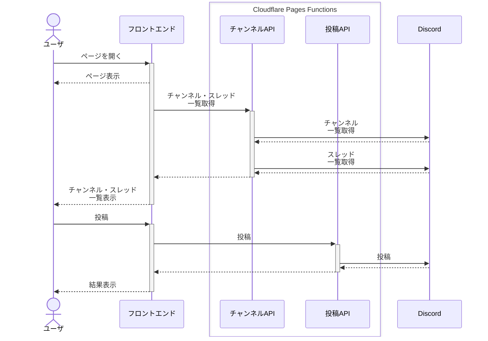

# Discord 匿名書き込みサービス GAKI

## 機能

- チャンネル・スレッドを指定した匿名書き込み（Bot が代理で書き込みます）
- Twitter・X・Pixiv → FxTwitter・FixupX・Phixiv のアドレス自動置換

## 今後の課題

- Bot に書き込み権限のないチャンネル・スレッドが一覧に表示されないようにする
- アドレス置換のオン・オフの追加
- (未確認)アクティブでないスレは一覧に出ないかも？

## 開発者向け

Cloudflare Pages の使用を前提に開発しています。

### 必要権限

#### OAuth2 スコープ

`bot` のみ

#### Bot 権限

- Read Messages/View Channels
- Send Messages

### ローカル実行

#### 環境変数定義

```sh
$ echo "DISCORD_API_TOKEN=<Discord Bot トークン>" >> .dev.vars
$ echo "GUILD_ID=<ギルドID>" >> .dev.vars
$ echo "CHANNELS_ACCESS_TOKEN=<チャンネルAPIアクセストークン>" >> .dev.vars
$ echo "POST_ACCESS_TOKEN=<投稿APIアクセストークン>" >> .dev.vars
$ echo "PASSWORD=<パスワード>" >> .dev.vars
```

※ `CHANNELS_ACCESS_TOKEN` と `POST_ACCESS_TOKEN` は `index.js` の記載と一致させてください

#### 実行

```sh
$ npm install # 初回のみ
$ npm run dev
```

### Cloudflare にデプロイ

```sh
$ npm run deploy
```

### アーキテクチャ

#### ディレクトリ構成

- src: フロントエンド
  - index.html
  - index.js
- functions: バックエンド
  - channels.ts : チャンネル取得 API
  - post.ts : 投稿 API

#### 処理シーケンス

<!-- prettier-ignore -->

